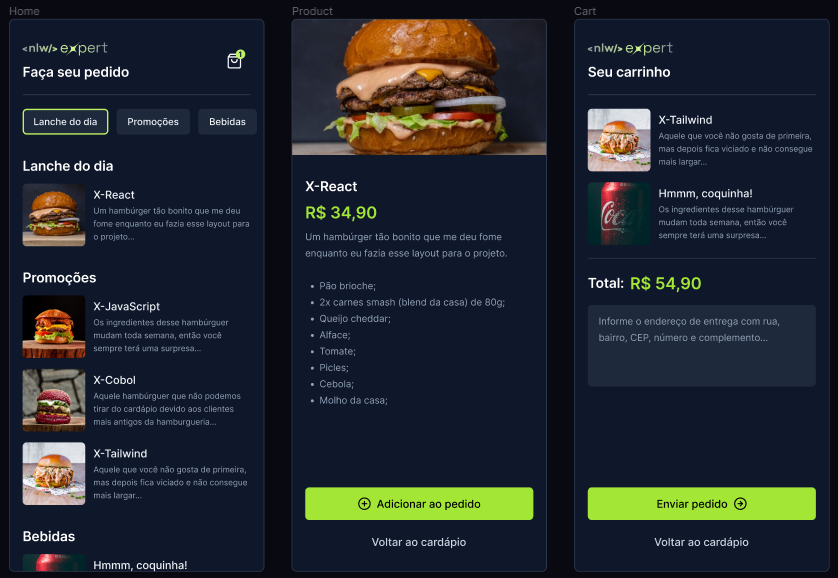

.

# NLW Expert Orders
Repositório de uma aplicação mobile que foi desenvolvida durante o NLW Experts 2024 da Rocketseat utilizando React Native, aplicação dos conceitos de Propriedades, Estados e Componentes, tipagem com Typescript, Expo Framework, interface com Native Wind, gerenciamento de estado global com Zustand, roteamento por arquivos com Expo Router.
